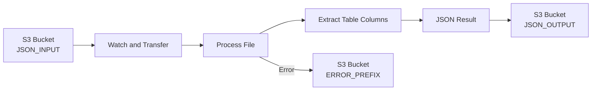

# AI Invoice JSON Formatter

A specialized service that extracts line items from complex invoice JSON structures produced by the docling library.

## Overview

The AI Invoice JSON Formatter is designed to work as a follow-up to the ai-invoice-extractor. It monitors an S3 bucket for JSON files containing complex invoice data, extracts specific table columns (like "Description" and "Gross worth"), and outputs simplified JSON files containing only the line items.

This service continuously watches a designated S3 bucket location, processes new files as they arrive, and handles errors gracefully.

## Features

- **S3 Integration**: Monitors S3 buckets for new files and processes them automatically
- **Asynchronous Processing**: Uses asyncio for efficient file handling
- **Table Extraction**: Identifies and extracts specific columns from invoice tables
- **Configurable Column Targeting**: Customizable target columns via environment variables
- **Robust Error Handling**: Comprehensive error handling with detailed logging
- **File Locking**: Prevents concurrent processing of the same file

## Architecture

The service follows a straightforward workflow:



1. **Watch and Transfer**: Continuously monitors the S3 bucket for new JSON files
2. **Process File**: Parses the JSON data from the file
3. **Extract Table Columns**: Identifies tables and extracts the specified columns
4. **JSON Result**: Creates a simplified JSON with just the line items
5. **Output**: Stores the result in the output location or moves failed files to the error location

## Installation

### Prerequisites

- Python 3.8+
- Access to an S3-compatible storage service

### Dependencies

```bash
pip install -r requirements.txt
```

Key dependencies:
- aioboto3
- python-dotenv
- docling

## Configuration

The service is configured through environment variables:

| Variable | Description | Default |
|----------|-------------|---------|
| S3_ENDPOINT_URL | S3 endpoint URL | - |
| S3_DEFAULT_REGION | S3 region | us-east-1 |
| S3_ACCESS_KEY_ID | S3 access key | - |
| S3_SECRET_ACCESS_KEY | S3 secret key | - |
| POLL_INTERVAL | Interval between polls (seconds) | 3 |
| TARGET_COLUMNS | Comma-separated list of columns to extract | Description,Gross worth |

You can set these variables in a `.env` file in the project root.

## Usage

Run the service:

```bash
python invoice_json_formatter.py
```

The service will start monitoring the configured S3 bucket for new files.

## S3 Integration Details

### Bucket Structure

The service uses the following S3 paths:

- `SOURCE_BUCKET/JSON_INPUT/`: Source location for input JSON files
- `SOURCE_BUCKET/JSON_OUTPUT/`: Destination for processed JSON files
- `SOURCE_BUCKET/ERROR_PREFIX/`: Location for files that failed processing

### File Processing

1. When a new file is detected in the input location, it's marked with an `.in-use` suffix
2. The file is downloaded and processed
3. The extracted data is uploaded to the output location
4. The `.in-use` file is removed
5. If processing fails, the file is moved to the error location

### File Locking

To prevent concurrent processing of the same file, the service:
1. Renames the file by adding an `.in-use` suffix
2. Deletes the original file
3. Processes the `.in-use` file
4. Deletes the `.in-use` file when done

## File Processing Workflow

### 1. Monitoring

The service continuously polls the S3 bucket for new files in the input location.

### 2. Processing

When a new file is found:
- It's marked as in-use
- The JSON data is parsed
- Tables are identified in the JSON structure
- Target columns are located in the table headers
- Data from those columns is extracted for each row
- A simplified JSON array is created with the extracted data

### 3. Output

- Successful results are stored in the output location
- Failed files are moved to the error location
- Detailed logs are generated throughout the process

## Error Handling

The service includes comprehensive error handling:

- JSON parsing errors
- S3 operation errors
- Table extraction errors
- Network errors

All errors are logged with detailed information to help with troubleshooting.


## Local Development Setup

1. Clone the repository
2. Install dependencies: `pip install -r requirements.txt`
3. Create a `.env` file with your configuration
4. Run the service: `python invoice_json_formatter.py`

### Testing

### Minio

```
brew install minio/stable/minio
```

```
mkdir ~/minio-data
```

```
minio server ~/minio-data --console-address :9001
```

```
open http://localhost:9001
```

Default
user: minioadmin
password: minioadmin


Then configure your `.env` file to point to the local service:

```
S3_ENDPOINT_URL=http://localhost:9000
S3_ACCESS_KEY_ID=minioadmin
S3_SECRET_ACCESS_KEY=minioadmin
```

## Running

The input files can be viewed/retrieved from the invoices bucket

To start

```bash
mc cp myminio/invoices/source/invoice_2.pdf myminio/invoices/intake/
```

View the docling converted JSON

```bash
mc cp myminio/invoices/json/invoice_2.json .
```

View the results of this JSON formatter

The results should land in the json-line-items bucket

```bash
mc cp myminio/invoices/json-line-items/invoice_2.json .
```

