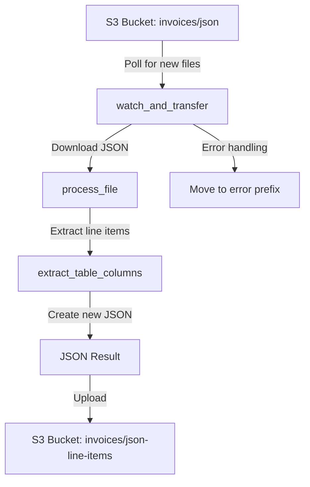

# Invoice JSON Formatter Improvement Plan

Based on analysis of the code and requirements, this plan outlines improvements to the invoice JSON formatter. The plan addresses identified issues and includes enhancements to make the code more robust and maintainable.

## Current System Overview



## Issues Identified

1. **File Path Issue**: The `extract_table_columns` function tries to read from a local file path instead of using the in-memory data downloaded from S3.
2. **Error Handling**: The error handling is inconsistent and could be improved.
3. **Logging**: Logging could be enhanced for better monitoring and troubleshooting.
4. **Code Structure**: Some parts of the code could be refactored for better maintainability.
5. **Inconsistencies**: There are references to PDF conversion in the comments, but the code is processing JSON files.
6. **Configuration**: The target columns ("Description" and "Gross worth") are hardcoded and should be configurable via environment variables.

## Improvement Plan

### 1. Fix the File Path Issue

Modify the `extract_table_columns` function to accept JSON data directly instead of a file path:

```python
def extract_table_columns(json_data: dict, target_column_names: list[str]):
    """
    Parses a DoclingDocument JSON data, finds tables containing specified
    column headers, and extracts the data from those columns for each row.

    Args:
        json_data (dict): The JSON data to process.
        target_column_names (list[str]): A list of column header names to extract.

    Returns:
        list[dict]: A list of dictionaries, where each dictionary represents a row
                    containing the data for the target columns from all relevant tables.
                    Returns an empty list if the data is not valid or the required 
                    columns are not found in any table.
    """
    all_extracted_rows = []
    
    # Process the JSON data directly instead of reading from a file
    tables = json_data.get('tables', [])
    if not tables:
        logger.warning("No tables found in the JSON data.")
        return all_extracted_rows
    
    # Rest of the function remains similar but with improved logging
    # ...
```

### 2. Make Target Columns Configurable

Add environment variables to configure the target columns:

```python
# ----- Configuration from Environment -----
ENDPOINT_URL = os.getenv("S3_ENDPOINT_URL")
REGION       = os.getenv("S3_DEFAULT_REGION", "us-east-1")
ACCESS_KEY   = os.getenv("S3_ACCESS_KEY_ID")
SECRET_KEY   = os.getenv("S3_SECRET_ACCESS_KEY")

POLL_INTERVAL = int(os.getenv("POLL_INTERVAL", 3))

# Default target columns if not specified in environment
DEFAULT_TARGET_COLUMNS = ["Description", "Gross worth"]
# Parse comma-separated list of target columns from environment variable
TARGET_COLUMNS = os.getenv("TARGET_COLUMNS", ",".join(DEFAULT_TARGET_COLUMNS)).split(",")
# Strip whitespace from each column name
TARGET_COLUMNS = [col.strip() for col in TARGET_COLUMNS]

SOURCE_BUCKET = "invoices"  
ERROR_PREFIX  = "error/"      # Prefix for files that failed processing
JSON_INPUT   = "json/"       # Prefix for retrieving JSON output
JSON_OUTPUT   = "json-line-items/"     # Prefix for storing JSON output

logger.info(f"ENDPOINT_URL: {ENDPOINT_URL}")
logger.info(f"REGION: {REGION}")
logger.info(f"ACCESS_KEY: {ACCESS_KEY}")
logger.info(f"SECRET_KEY: {SECRET_KEY}")
logger.info(f"POLL_INTERVAL: {POLL_INTERVAL}")
logger.info(f"TARGET_COLUMNS: {TARGET_COLUMNS}")
```

Update the process_file function to use the configured target columns:

```python
async def process_file(key: str, data: bytes):
    """
    Process a file from the S3 bucket.
    
    Args:
        key (str): The S3 object key
        data (bytes): The file content as bytes
        
    Returns:
        list[dict]: Extracted line items or None if processing failed
    """
    logger.info(f"Processing {key}: {len(data)} bytes")
    
    # Get the filename from the key
    filename = os.path.basename(key)
    
    # Check if this is a JSON file
    if filename.lower().endswith('.json'):
        try:
            # Parse JSON data from bytes
            json_data = json.loads(data.decode('utf-8'))
            logger.info(f"Successfully parsed JSON from {filename}")
            
            # Extract line items using configured target columns
            line_items = extract_table_columns(json_data, TARGET_COLUMNS)
            
            if not line_items:
                logger.warning(f"No line items found in {filename}")
            else:
                logger.info(f"Extracted {len(line_items)} line items from {filename}")
            
            return line_items
            
        except json.JSONDecodeError as e:
            logger.error(f"Failed to parse JSON from {filename}: {str(e)}")
            raise
        except Exception as e:
            logger.error(f"Unexpected error processing {filename}: {str(e)}")
            raise
    else:
        logger.warning(f"File {filename} is not a JSON file, skipping")
        return None
```

### 3. Improve Error Handling

Enhance error handling throughout the code:

- Use more specific exception types where possible
- Add context to error messages
- Implement proper cleanup in error cases
- Use consistent error handling patterns

### 4. Enhance Logging

Improve logging for better monitoring and troubleshooting:

- Add structured logging with consistent format
- Include more context in log messages
- Add log levels appropriate to the message importance
- Log key metrics (processing time, file sizes, etc.)

### 5. Refactor Code Structure

Refactor the code for better maintainability:

- Create a dedicated class for S3 operations
- Separate the table extraction logic from the main processing flow
- Use more descriptive variable names
- Add type hints throughout the code

### 6. Fix Inconsistencies

Remove or update references to PDF conversion in the comments and code.

## Implementation Steps

1. **Update Environment Configuration**
   - Add TARGET_COLUMNS environment variable
   - Update .env file with default values
   - Add validation for required environment variables

2. **Refactor extract_table_columns Function**
   - Modify to accept JSON data directly instead of a file path
   - Improve error handling and logging
   - Add better documentation

3. **Update process_file Function**
   - Remove references to PDF conversion
   - Pass JSON data directly to extract_table_columns
   - Use configured target columns
   - Improve error handling

4. **Enhance watch_and_transfer Function**
   - Improve error handling and logging
   - Add metrics for monitoring
   - Refactor for better readability

5. **Create S3 Helper Class**
   - Encapsulate S3 operations
   - Add retry logic for S3 operations
   - Improve error handling

## Expected Outcomes

1. **Flexibility**: The system will be more flexible with configurable target columns.
2. **Reliability**: The system will be more reliable with better error handling and retry logic.
3. **Maintainability**: The code will be easier to maintain with better structure and documentation.
4. **Observability**: Enhanced logging will make it easier to monitor and troubleshoot issues.
5. **Performance**: The system will be more efficient by processing data in memory instead of writing to disk.

## Testing Strategy

1. **Unit Tests**: Add unit tests for the refactored functions.
2. **Integration Tests**: Test the end-to-end flow with sample data.
3. **Error Handling Tests**: Verify that errors are handled correctly.
4. **Configuration Tests**: Verify that different target column configurations work correctly.
5. **Performance Tests**: Measure the performance improvements.